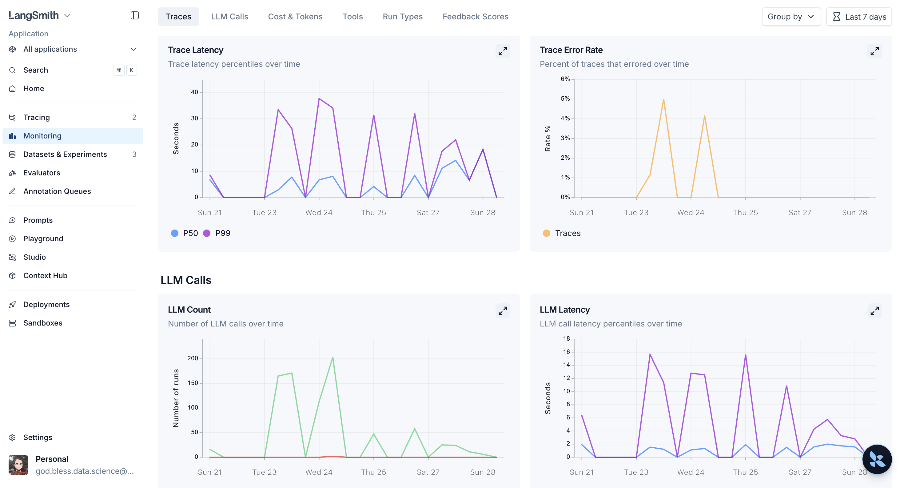

# AI Trader — Architecture

A semi-autonomous research assistant for Polymarket. The core is a **custom LangGraph
ReAct agent with a skills layer**. This document describes how it works today; see
[PLAN.md](PLAN.md) for status and roadmap.

---

## 1. Big picture

```
Telegram (aiogram)  ──HTTP──▶  FastAPI service  ──▶  ReAct agent (LangGraph)
                                                         │
                                          tools ◀────────┤   web_search (Tavily)
                                                         │   polymarket_search / _market (Gamma API)
                                          checkpointer ◀──┘   (per-thread memory)
```

- **Telegram** is the chat UI. It forwards each message (slash command included) to the
  agent over HTTP and renders the reply.
- **FastAPI** hosts the agent (`POST /agent/invoke`, `GET /health`).
- **The agent** is a custom graph (not `create_react_agent`) so we control skill routing,
  guardrails, the loop budget, and structured output.

---

## 2. The graph

Nodes and transitions (`core/agents/react.py`):

```
START → skills → planner ──tool_calls?──→ guard ──allow?──→ executor ──budget?──→ planner
                         │                     └─block──→ planner   │  (else)    └─→ responder
                         └─final answer──────────────────────────────→ responder → verifier ──ok?──→ END
                                                                                            └─revise──→ planner
```

| Node | Role | Model |
|------|------|-------|
| `skills` (Selector) | Pick at most one skill for the turn, or normal mode. | weak |
| `planner` | The "reason" step: decide to call tools or draft an answer. | **strong** |
| `guard` | Safety gate: judge the proposed tool calls before they run. | weak |
| `executor` | The "act" step: run the requested tool calls in parallel. | — |
| `responder` | Synthesize the conclusion into the skill's structured schema. | weak |
| `verifier` | Final gate: anti-hallucination check on the structured result. | — |

**Loop budget.** The real budget is the `iteration` counter (planner steps), capped at
`AGENT_MAX_ITERATIONS`. When it runs out, the executor routes straight to the responder
(so the already-requested tools still run and the history stays valid) and the verifier
stops revising. `recursion_limit` is only a safety net.

**Feedback channel.** `guard` (block) and `verifier` (revise) append a `SystemMessage`
explaining *why* before control returns to the planner, so it can actually fix the issue
instead of repeating itself.

---

## 3. Skills layer

A **Skill** is a *specialization* of the base loop, not a procedure (`core/skills/base.py`):

```python
@dataclass(frozen=True)
class Skill:
    name: str                       # "find"
    triggers: tuple[str, ...]       # slash commands, e.g. ("find",)
    description: str                # for intent matching / help
    planner_prompt: str             # appended to the base planner prompt
    guard_prompt: str               # appended to the base guard prompt
    responder_prompt: str           # replaces the base responder prompt
    output_schema: type[SkillResult]# structured shape the responder targets
    tools: tuple[BaseTool, ...]     # tools the planner may call
```

**Selection** (`core/components/selector`) runs first, cheapest path first:
1. An explicit slash command in the latest message (`/find ...`) → that skill, deterministically.
2. Otherwise an LLM classifies intent against the skill catalog, or returns normal mode.

Only **one** skill per turn. The selector records the skill **name** (a string) in the
graph state — *not the Skill object* — because the checkpointer serializes the state and a
Skill carries non-serializable tools/schema (see §6). The skill-aware nodes resolve the
name back to a `Skill` via the shared registry.

**Normal mode** is first-class: when no skill is chosen, the nodes fall back to base
prompts, base tools (`web_search`), and the `GeneralAnswer` schema.

Implemented skills (`core/skills/`):

- **`find`** — research a topic. Tools: `polymarket_search`, `web_search`. Output: `ResearchResult`.
- **`analyze`** — deep dive on one market given its URL. Tools: `polymarket_market`,
  `polymarket_search`, `web_search`. Output: `MarketAnalysis`.

Adding a skill = one module (prompts + schema + tools) registered in `skills/__init__.py`.
No graph or component changes.

---

## 4. Structured output & anti-hallucination

The planner reasons in free text; the **responder** coerces the conclusion into the active
skill's schema via `with_structured_output`, so callers consume structure, not prose
(`core/models/domain.py`):

- `SkillResult` (base) — guarantees a `summary`. Also exposes `referenced_market_ids()`.
- `GeneralAnswer` — normal mode: just the summary.
- `ResearchResult` — `find`: a ranked list of `Suggestion`s, each with a `RiskAssessment`.
- `MarketAnalysis` — `analyze`: implied vs. fair probability, edge, stance
  (lean_yes/lean_no/pass), confidence, key factors, and a `RiskAssessment`.

The **verifier** enforces the trust guarantee: every market id the result references
(`referenced_market_ids()`) must actually appear in some tool output from this run.
Anything invented triggers a `revise` with feedback. Because the check is expressed via a
method on the result, it works for any current or future schema without touching the
verifier.

---

## 5. Tools & clients

Tools are built by a factory (`core/tools`) and injected at the composition root — no
import-time side effects. Each returns a compact JSON string; prices are normalized to
implied probabilities in the client layer so the model reasons in one unit.

- `polymarket_search(query, limit)` — Gamma `public-search`, active markets.
- `polymarket_market(slug)` — Gamma `/markets?slug=` then `/events?slug=`; full detail for
  one market incl. resolution criteria. Accepts a market slug, an event slug, or a full URL.
- `web_search(query, max_results)` — Tavily, news/context for edge assessment.

Clients live in `core/clients/{polymarket,tavily}` and are pure HTTP wrappers.

---

## 6. Memory & models

**Checkpointer.** The graph compiles with a checkpointer keyed by `thread_id` (the chat
id), so each chat has its own conversation memory. Today it's an in-process
`InMemorySaver`; swapping in `langgraph-checkpoint-postgres`' `PostgresSaver` is a one-line
change in `bootstrap.py`. Note: the checkpointer **serializes** the state on every step
(even in-memory), which is why the active skill is stored as a name, not as an object.

**Two model tiers** (`OPENAI_MODEL_STRONG` / `OPENAI_MODEL_WEAK`). The planner — the
reasoning step — gets the stronger model; selection, guarding and response synthesis get
the lighter one. The executor and verifier use no LLM.

---

## 7. Interfaces

**FastAPI** (`app/`):

| Method | Path | Purpose |
|--------|------|---------|
| POST | `/agent/invoke` | Run a turn, return the whole answer at once. Body `{message, thread_id, debug}`; `X-API-Key` if `AGENT_API_KEY` is set. Returns `{response (markdown), result (structured), trace_url}`. |
| POST | `/agent/stream` | Same input, streamed as Server-Sent Events: `status` frames during the run, then a terminal `final` frame with the same payload as `/invoke` (or an `error` frame). |
| GET | `/health` | Liveness. |

**Live progress.** Progress is modelled as semantic `ProgressEvent`s
(`core/models/streaming.py`): a `label` like `tool:web_search` plus an optional `detail` (a
query or slug). The agent emits them from `Agent.astream`; the final event carries the
structured result. Rendering — emoji, wording, language — is the client's job, so the same
stream drives any UI.

**Telegram** (`ui/telegram/`): aiogram long-polling. `/find`, `/analyze`, `/start`,
`/help`; plain text → normal mode / intent routing. The handlers forward the full text
(slash included) so the selector can activate the skill. They consume `/agent/stream` and
edit a single message in place ("selected `find` → searching markets → synthesizing…")
until the final answer replaces it. Access is gated by a chat-id allowlist.

---

## 8. Configuration

`pydantic-settings` from `.env` (`common/config.py`): `OPENAI_API_KEY`,
`OPENAI_MODEL_STRONG`, `OPENAI_MODEL_WEAK`, `TAVILY_API_KEY`, `TELEGRAM_API_TOKEN`,
`TELEGRAM_ALLOWED_CHAT_IDS`, `AGENT_MAX_ITERATIONS`, `AGENT_APP_URL`, `AGENT_API_KEY`,
and the standard `LANGSMITH_*` tracing vars.

---

## 9. Testing

Three tiers (`pytest`, markers in `pyproject.toml`):

- **offline** (default) — pure parsers and composition-root wiring; no network, no LLM.
- **`-m llm`** — smoke tests with real model calls: skill selection, structured output,
  the anti-hallucination guarantee, and tool use.
- **`-m live`** — hits the Gamma API.

---

## 10. Evaluation

A separate, vendor-neutral eval harness (`tests/eval/`, CLI-driven — not pytest). An
**evaluation = one skill + its cases**; cases live as YAML in `tests/eval/datasets/<skill>/`
(source of truth, versioned) and are synced into a backend dataset per run.

- **Evaluators** (`evaluators.py`): `grounding` (deterministic — every referenced market id
  came from a tool, mirrors the runtime verifier), `routing` (deterministic — the selector
  picked the expected skill), `tool_calls` (deterministic metric — number of tool calls, to
  spot under-research or runaway loops), `quality` (LLM-judge against the skill's rubric),
  and `depth` (LLM-judge for analytical depth/expertise, independent of quality). Cost and
  token totals are read from LangSmith's native per-run aggregation (not recomputed) and
  printed by the CLI after each run.
- **Backend abstraction** (`runner.py` `EvalBackend` protocol). `backends/langsmith.py` is the
  only module importing the vendor SDK: cases → dataset examples, a run → an `aevaluate`
  experiment (each turn a linked trace), our `Score`s → feedback. Swapping in Langfuse is a
  new backend behind the same protocol.
- **CLI** (`cli.py`): `run [--skill]`, `list`, `add-case --trace <id> --skill <s>` (distils a
  case from a real LangSmith trace). Also `make eval [SKILL=find]`.

Each run becomes a LangSmith **experiment** linked to the skill's dataset, so scores are
comparable across iterations. The Datasets & Experiments view tracks each evaluator
(`depth`, `grounding`, `quality`, `routing`, `tool_calls`) plus latency, with per-experiment
averages and deltas against a chosen baseline:


---

## 11. Observability

Every turn is traced to **LangSmith** (`LANGSMITH_*` config). Tracing has three modes,
chosen per request in `app/main.py`:

- **No key** → tracing off; the agent just runs.
- **Compressed (default)** → one root span (`agent.invoke` / `agent.stream`) carries the
  turn's input/output while the nested graph runs with tracing suppressed, so routine
  traffic stays observable without a full graph under every run.
- **Debug** (Telegram `/debug` or `debug: true`) → the full nested trace, and the trace URL
  is handed back in the response.

A debug trace is a waterfall over the whole graph — `skills → planner → guard → executor`
— with every LLM call and tool call (and its inputs/outputs) underneath, which is how a turn
is inspected when an answer looks wrong:


Across runs, LangSmith's **Monitoring** dashboard tracks latency (P50/P99), error rate, LLM
call volume and LLM latency over time — the health view for the deployed service:



---

## 12. Deployment

DigitalOcean App Platform (`.do/app.yaml`), one `Dockerfile` → two components: the `agent`
FastAPI service (public, health-checked) and the `telegram` worker (calls the agent over
the internal network). Tracing flows to LangSmith.

---

## 13. Code map

```
src/trader/
├── app/                    # FastAPI: main.py, schemas.py, formatting.py
├── ui/telegram/main.py     # aiogram bot
├── common/config.py        # pydantic-settings
└── core/
    ├── bootstrap.py        # composition root — wires everything
    ├── prompts.py          # base + selector prompts
    ├── agents/react.py     # the graph (topology only)
    ├── components/         # graph nodes: selector, planner, guard, executor, responder, verifier
    ├── models/             # domain.py (output schemas), schemas.py (state), protocols.py, streaming.py (progress events)
    ├── skills/             # base.py (Skill + registry), find.py, analyze.py
    ├── tools/              # build_tools factory + input schemas
    └── clients/            # polymarket (Gamma), tavily
```
